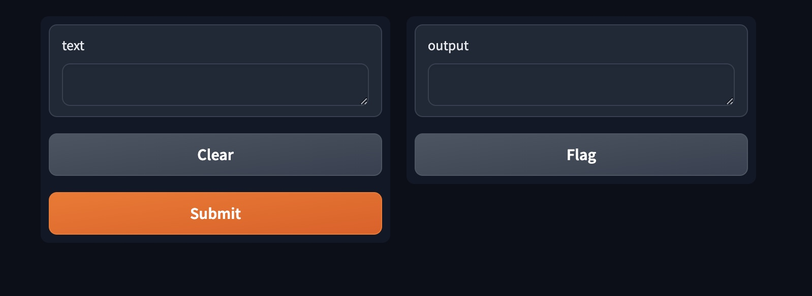
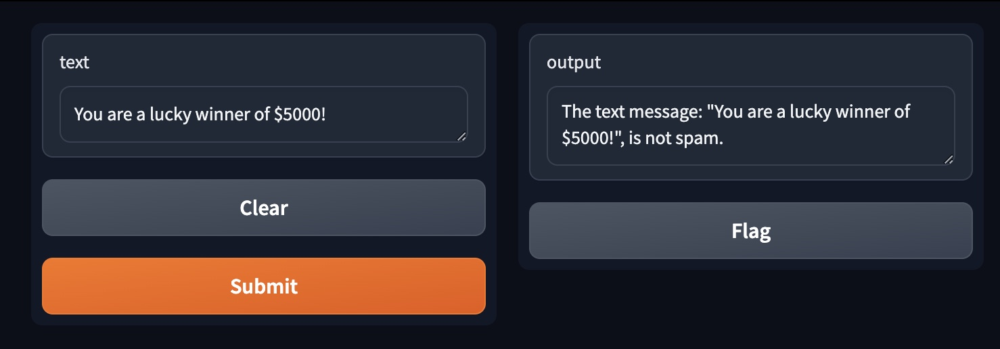

# SMS Spam Detector

## Project Overview
The SMS Spam Detector project involves creating a machine learning model to classify SMS text messages as spam or not spam. The project uses a pipeline with TF-IDF vectorization and Linear Support Vector Classification (SVC). The model is then hosted on a Gradio interface, allowing users to input SMS messages and receive predictions. 

## Table of Contents
1. Project Overview
2. Installation
3. Usage
4. Project Structure
5. Implementation Details
6. Example Inputs

## Installation
To run this project locally, follow these steps:
1. Clone the repository:
`git clone https://github.com/galedione/sms_spam_detector.git`
`cd sms_spam_detector`

2. Install the required dependencies:
You can install the necessary Python packages using `pip`:
`pip install pandas scikit-learn gradio jupyterlab`

3. Open JupyterLab:
`jupyter lab`

## Usage
To use the project, follow these steps:

1. Open the JupyterLab by running `jupyter lab` in your terminal.
2. Open the `gradio_sms_text_classification.ipynb` notebook.
3. Follow the instructions in the notebook to load the dataset, train the model, and launch the Gradio app. 

## Using the Gradio Interface
1. After running the relevant cells in the notebook, a URL will be provided.
2. Open the URL in your web browser. 
3. Enter an SMS text message in the input box. 
4. Click the "Submit" button. 
5. The application will display whether the message is classified as "spam" or "not spam". 

## Project Structure
The project consists of the following files:
* `gradio_sms_text_classification.ipynb`: Jupyter Notebook containing the Gradio app implementation.
* `sms_text_classification_solution.ipynb`: Jupyter Notebook containing the initial SMS classification solution.
* `SMSSpamCollection.csv`: CSV file containing the dataset used for training and testing the model. 

## Implementation Details

### Data Loading and Preprocessing
The dataset (`SMSSpamCollection.csv`) is loaded into a DataFrame and missing values are removed. The data contains two columns:
* `label`: Indicates whether the message is spam or not (`'spam' or 'ham'`). 
* `text_message`: The text message content.

### SMS Classification Function
The `sms_classification` function performs the following steps:
1. Sets the features and target variables. 
2. Splits the data into training and testing sets with stratification to maintain class distribution. 
3. Builds a pipeline with TF-IDF vectorization and LinearSVC.
4. Fits the model to the training data and returns the fitted pipeline.

### SMS Prediction Function
The `sms_prediction` function takes the fitted model and a text message as input, predicts whether the message is spam or not, and returns the appropriate message.

### Gradio Interface
The Gradio interface is created with a function that uses the `sms_prediction` function to classify user-inputted messages. The interface has a textbox for input and output, and labels to guide the user.

## Example Inputs
Use the following example messages to test the application:
1. "You are a lucky winner of $5000!"
2. "You won 2 free tickets to the Super Bowl."
3. "You won 2 free tickets to the Super Bowl. Text us to claim your prize."
4. Thanks for registering. Text 4343 to receive free updates on medicare."

## Example Outputs

